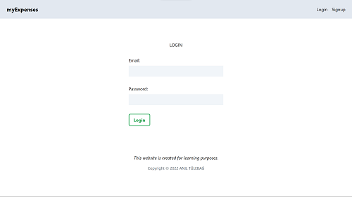
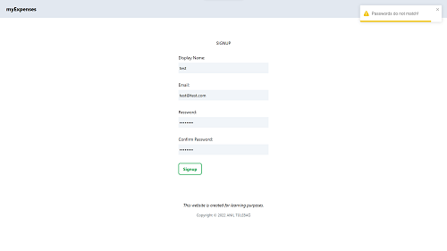
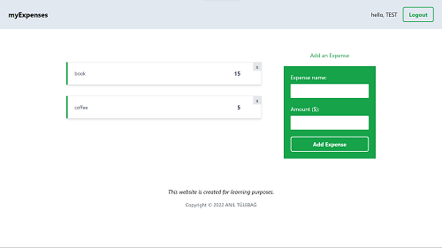

# Simple Expense Tracker with React and Firebase

Demo React application where users can add and delete expenses after creating their accounts. You will need to setup your own Firebase account if you want to use this app yourself.

## Tech Stack

<p align="left">


</p>

## Demo

[Demo Link](https://mymoney-test-9ddba.web.app/)

You can use test account information to try my demo

Email: test@test.com

Password: 12345678

## Screenshots







## Run Locally

Clone the project

```bash
  git clone https://link-to-project
```

Go to the project directory

```bash
  cd my-expenses
```

Install dependencies

```bash
  npm install
```

Start the server

```bash
  npm run start
```

## Environment Variables

To run this project, you will need to add the following environment variables to your .env file

`REACT_APP_API_KEY`

`REACT_APP_AUTH_DOMAIN`

`REACT_APP_PROJECT_ID`

`REACT_APP_STORAGE_BUCKET`

`REACT_APP_MESSAGING_SENDER_ID`

`REACT_APP_APP_ID`

Setup a new [Firebase](https://console.firebase.google.com/) project and update environment variables with your new Firebase web app config information.

## Deployment

To deploy this project run

```bash
  npm run build
```

## License

[MIT](https://choosealicense.com/licenses/mit/)
